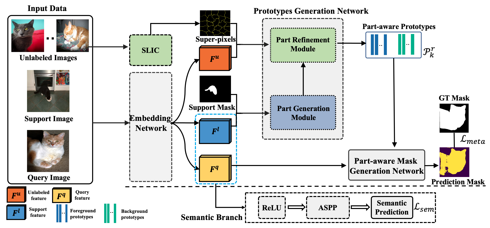

# Part-aware-Prototype-Network
Official Implementation of [Part-aware Prototype Network for Few-shot Semantic Segmentation](https://arxiv.org/pdf/2007.06309.pdf) (ECCV 2020)


## Installation

### Dependencies
* Python 3.7.3
* PyTorch 1.3.1
* torchvision 0.4.2
* Cuda version 10.0
* [pykeops](https://www.kernel-operations.io/keops/python/installation.html)




## Get Started
```
git clone 
cd PPNet-PyTorch
mkdir logs
mkdir outputs
```

### Data Preparation for VOC Dataset
**1. Download Pascal VOC dataset**

Please go to [PANet](https://github.com/kaixin96/PANet) and download VOC dataset
and put them under FewShotSeg-dataset/Pascal folder.
```
# symlink the pascal dataset
mkdir -p FewShotSeg-dataset/Pascal
ln -s /path_to_pascal_dataset/ FewShotSeg-dataset/Pascal/
```

**2. Download pretrained model**

Download the [ResNet50](https://download.pytorch.org/models/resnet50-19c8e357.pth) 
and [Resnet101](https://download.pytorch.org/models/resnet50-19c8e357.pth)
weights and put them under FewShotSeg-dataset/cache/ folder.

**3. Download the unlabel superpixel data**

Download the unlabel superpixel from [here](https://drive.google.com/file/d/1732jFI0qQBkGyjlWVExxyZYSru7HACkP/view?usp=sharing) and 
put it under FewShotSeg-dataset/Pascal/superpixel folder.


### Training & Evaluation in Command Line for Pascal VOC
```
# Train baseline model 
sh script/train_fewshot.sh

# Train part model
sh script/train_part.sh

# Train part+semantic branch model
sh script/train_part_sem.sh

# Train part + semantic branch + unlabel data model
sh script/train_graph.sh

```

### Inference by pretrained model
Change the ```ckpt_dir``` in script to your pretrained model path.
```
# Test baseline model 
sh script/test_fewshot.sh

# Test part model
sh script/test_part.sh

# Test part+semantic branch model
sh script/test_part_sem.sh

# Test part + semantic branch + unlabel data model
sh script/test_graph.sh
```

|   1-way 1-shot | Download link             |        meanIoU                                | 
|-----------------------|:--------------------------------------------------:|:--------------------------------------------------:|
| PANet* | [model](https://drive.google.com/drive/folders/1OrVJ74LbhgUhIOp8nen79Yv56esO4an4?usp=sharing)                |  49.10  |
| Our + part | [model](https://drive.google.com/drive/folders/1cZBV-v8uvbmWPhiAlBDyYUT8MoT6zzto?usp=sharing)            |  50.40  | 
| Our + part + sem | [model](https://drive.google.com/drive/folders/1MDy_-Mt4lLyUWPhXOTcssrT5R0rI6IPZ?usp=sharing)      |  51.50  |
| Our + part + sem + un | [model](https://drive.google.com/drive/folders/1gbgYrTTcdkaS48C6ohlSc0NhK26wdoV_?usp=sharing) |  52.84  |

log files are available [here](https://drive.google.com/drive/folders/1mXidsz9WtUFjx9OEw94N2oN3mDT-I6ix?usp=sharing)
## Visualization for Pascal VOC


## Citation
Please consider citing our paper if the project helps your research. BibTeX reference is as follows.
```
@article{liu2020part,
  title={Part-aware Prototype Network for Few-shot Semantic Segmentation},
  author={Liu, Yongfei and Zhang, Xiangyi and Zhang, Songyang and He, Xuming},
  journal={arXiv preprint arXiv:2007.06309},
  year={2020}
}
```
